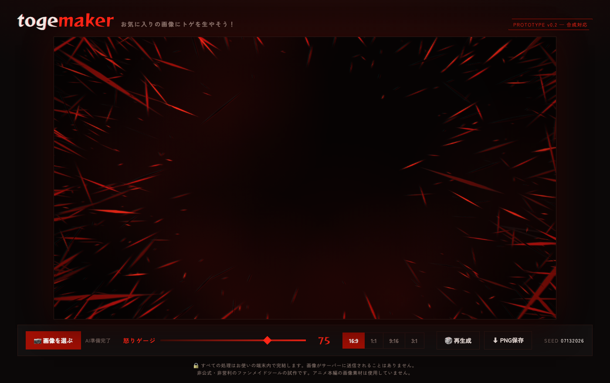

# togemaker（トゲメーカー）

**お気に入りの画像にトゲを生やそう！**

アップロードした画像の被写体をAIが自動で切り抜き、黒背景に赤と黒の鋭利な破片が飛び散る
「トゲトゲ」風の背景に合成できるWebツールです。怒りゲージを上げるほどトゲが増えて中心に迫ります。



## 特徴

- 🔒 **完全ブラウザ内処理** — 画像がサーバーに送信されることはありません（そもそもサーバーがありません）
- ✂️ **AI背景除去** — ONNX Runtime Web + ISNet（int8量子化・46MB）をブラウザ内で実行
- 🌵 **トゲトゲ背景は手続き生成** — 素材画像なし、Canvasでシード付きランダム描画。
  怒りゲージ（トゲの量・鋭さ）、🎲再生成、アスペクト比切替（16:9 / 1:1 / 9:16 / 3:1）
- 🖐️ **直感的な操作** — ドラッグで移動、ホイール/ピンチで拡大縮小、⌥+ホイール/2本指で回転
- 💸 **運用費0円** — 静的サイトのみ（Cloudflare Pages想定）。バズっても無料

## 開発

```bash
npm install
npm run dev   # → http://localhost:5173/
```

AIモデル（量子化・分割済み）はリポジトリに同梱されているため、追加のセットアップは不要です。

| コマンド | 内容 |
|---------|------|
| `npm run dev` | 開発サーバー |
| `npm run build` | 本番ビルド → `dist/` |
| `npm run preview` | ビルド結果のプレビュー |
| `npm run setup` | fp32元モデルの取得（量子化パイプライン用・通常は不要） |

背景除去の単体検証ページ: `/cutout.html`（開発時のみ・ビルドには含まれません）

## 技術スタック

| レイヤー | 技術 |
|---------|------|
| フロントエンド | Vite + TypeScript（フレームワークなし）+ Canvas API |
| 背景除去 | [onnxruntime-web](https://github.com/microsoft/onnxruntime)（マルチスレッドWASM） + [ISNet](https://github.com/xuebinqin/DIS) |
| ホスティング | Cloudflare Pages（帯域無制限・無料） |

詳細は [docs/spec.md](docs/spec.md)（仕様書）、[docs/design/architecture.md](docs/design/architecture.md)（設計）、
[docs/guides/setup.md](docs/guides/setup.md)（環境構築）、[docs/guides/deployment.md](docs/guides/deployment.md)（デプロイ）、
[docs/decisions/](docs/decisions/)（ADR）を参照してください。

## クレジット

- 着想: [InspirationCat（キュピーン猫画像メーカー）](https://x.com/nya3_neko2)の
  「サーバーに計算させない・保存させない・転送はCDNに任せる」構成をオマージュしています
- 背景除去モデル: [ISNet isnet-general-use](https://github.com/xuebinqin/DIS)（Apache-2.0）の
  [rembg](https://github.com/danielgatis/rembg) 配布ONNX変換版を int8 量子化して使用
- ランタイム: [onnxruntime-web](https://github.com/microsoft/onnxruntime)（MIT）

## 免責

本ツールは**非公式・非営利のファンメイド作品**です。アニメ本編の画像素材は一切使用しておらず、
トゲトゲ表現はすべてCanvasによる自前描画です。権利者様からのご指摘があれば速やかに対応します。
